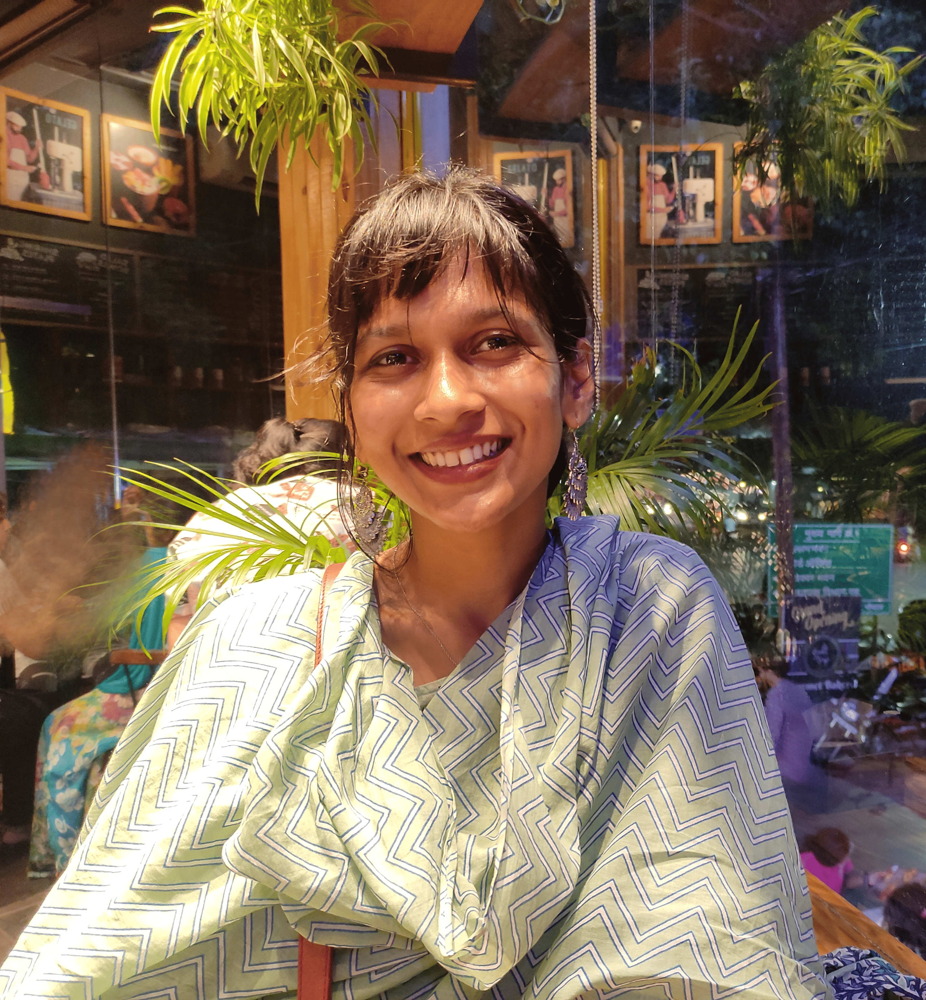

# About me

Hi! I’m **Gauri Kotiwale** (गौरी कोटीवाले), a PhD student at the Institute of Science and Technology Austria (ISTA). My research focuses on understanding the chemical enrichment and stellar populations of galaxies in the early Universe through the study of their rest-optical and rest-UV spectra. I come from Pune, India and, have completed my Bachelor's and Master's in Physics at the Indian Institute of Science Education and Research, Bhopal.

## Connect with Me

- 📧 [gauri.kotiwale@ista.ac.at](mailto:gauri.kotiwale@ista.ac.at)
- [ 0009-0007-1062-0253](https://orcid.org/0009-0007-1062-0253)
- [ GauriKotiwale](https://github.com/Gauri0002)

---
